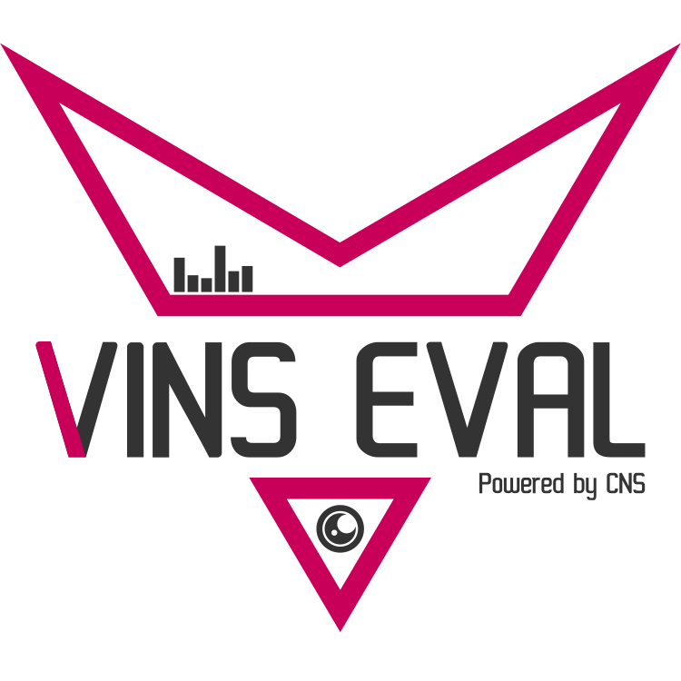

<br />
<div align="center">
  <a href="#"></a>
</div>
<h3>VINSEval</h3>

> VINSEval: Evaluation Framework for Unified Testing of Consistency and Robustness of Visual-Inertial Navigation System Algorithms

## Introduction

VINSEval is a unified evaluation framework to evaluate with statistical relevance the consistency and robustness of VINS algorithms in a fully automated fashion over a multitude of parameters and parameter ranges.

## How to

[](https://www.youtube.com/watch?v=KuA3nibxWok)

For a detailed description on how to install and use the framework, please refer to our Wiki page.

#### Fast Installation

1. Install all required prequesites
```bash
# UPDATE
sudo apt update
# ROS PACKAGES
export ROS_DISTRO=$(rosversion -d)
sudo apt install ros-${ROS_DISTRO}-tf \
  ros-${ROS_DISTRO}-cv-bridge \
  ros-${ROS_DISTRO}-message-filters \
  ros-${ROS_DISTRO}-image-transport \
  ros-${ROS_DISTRO}-rosbaglive
# GRAPHIC DRIVERS
sudo apt install -y libzmqpp-dev libeigen3-dev
sudo apt install -y libvulkan1 vulkan-utils gdb
# NOTE: For AMD GPUs run also sudo apt install -y mesa-vulkan-drivers
```

1. Clone this repository and initialise its ROS workspace
```bash
git clone https://github.com/aau-cns/vins_eval.git vinseval_cws
# Init submodules
cd vinseval_cws
git submodule update --init --recursive --remote
# Init workspace
catkin init
echo 'source ~/vinseval_cws/devel/setup.bash' >> ~/.bashrc
# Build workspace
export ROS_DISTRO=$(rosversion -d)
rosdep install --from-paths src --ignore-src --rosdistro ${ROS_DISTRO} -y
```

Now you can use either the provided Docker environment or build it on your system yourself. Please consult the Wiki for a detailed explanation on both install and use cases.


## Authors

* Alessandro Fornasier ([email](mailto:alessandro.fornasier@aau.at?subject=[VINS%20Eval]))
* Martin Scheiber ([email](mailto:martin.scheiber@aau.at?subject=[VINS%20Eval]))
* Alexander Hardt-Stremayr ([email](mailto:Alexander.hardt-stremayr@aau.at?subject=[VINS%20Eval]))
* Roland Jung ([email](mailto:roland.jung@aau.at?subject=[VINS%20Eval]))

## License
This software is made available to the public to use (_source-available_),
licensed under the terms of the BSD-2-Clause-License with no commercial use allowed, the full terms of which are made available in the LICENSE file. No license in patents is granted.

### Usage for academic purposes
If you use this software in an academic research setting, please cite the
corresponding paper and consult the `LICENSE` file for a detailed explanation.

```latex
@inproceedings{vinseval,
   author   = {Alessandro Fornasier and Martin Scheiber and Alexander Hardt-Stremayr and Roland Jung and Stephan Weiss},
   journal  = {2021 Proceedings of the IEEE International Conference on Robotics and Automation (ICRA21 - accepted)},
   title    = {VINSEval: Evaluation Framework for Unified Testing of Consistency and Robustness of Visual-Inertial Navigation System Algorithms},
   year     = {2021},
}
```
